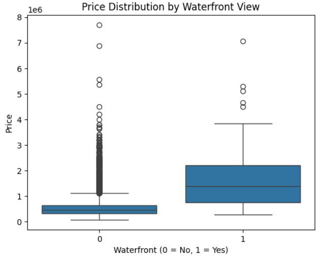
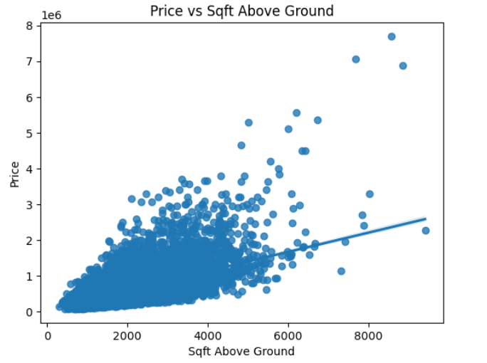

# King County House Price Prediction

A data science project that uses regression models to predict house prices in King County, Washington. This project explores the relationship between housing features and sale prices, applying machine learning techniques to build a predictive model.

---

## 📌 Project Overview

This project aims to:
- Analyze housing market data to uncover key factors influencing property prices in King County, WA
- Apply machine learning models to predict house prices based on structural and locational features
- Evaluate model performance using metrics like R² and RMSE to identify the most accurate approach
- Generate actionable insights for buyers, sellers, or investors by interpreting feature importance and pricing trends

Whether you are a data science enthusiast or a real estate investor, this project offers a practical look into predictive modeling using real-world data.

---

## 📁 Repository Structure
machine-learning-for-house-market-insights/
```
├── data/
│ ├── kc_house_data.csv
├── images/
│ ├── price_vs_sqft.png
│ └── price_distribution_by_waterfront_view.png
├── notebook/
│ └── House_Sales_in_King_Count_USA.ipynb # main script
├── README.md
├── LICENSE
└── .gitignore
```
---

## 📊 Dataset

- **Source**: [Kaggle - House Sales in King County, USA](https://www.kaggle.com/datasets/harlfoxem/housesalesprediction)
- **Size**: ~21,000 rows, 21 columns
- **Features**: Includes price, bedrooms, bathrooms, sqft, location, and more

---

## 🧪 Technologies Used

- **Python 3.9+**
- **Pandas** – Data manipulation and numerical operations
- **Matplotlib & Seaborn** – Visualization and exploratory analysis
- **Scikit-learn** – Machine learning models, pipelines, and evaluation metrics
- **Jupyter Notebook** – Interactive analysis
- **PolynomialFeatures & Ridge Regression** – Advanced modeling techniques for non-linear relationships and regularization

---

## 📈 Modeling Approach

1. **Data Cleaning**
   - Imputed missing values and removed outliers to ensure data integrity
   - Engineered new features to enhance model performance (e.g., price_per_sqft, age)

2. **Exploratory Data Analysis (EDA)**
   - Visualized correlations
   - Distribution plots
   - Analyzed price distributions across key features like grade, bathrooms, and location

3. **Modeling**
   - Single Linear Regression
   - Multiple Linear Regression
   - Polynomial Regression Pipeline
   - Ridge Regression (Regularized Linear Model)
   - Polynomial Ridge Regression (Best Model with R² ≈ 0.70 on test data)

4. **Results**
   - Polynomial Ridge Regression delivered the best balance of accuracy and generalization, achieving an R² of approximately 0.70 on the test set.
   - Top predictive features included sqft_living, grade, bathrooms, and lat, confirming that both structural quality and location play key roles in price estimation.

---

## 📷 Sample Visualizations



*Price Distribution by Waterfront View*



*Price Vs. Sqft Above Ground*

---

## ✨ Insights
- Waterfront properties command premium prices: Despite being a binary feature, waterfront has a strong positive correlation with price and shows clear price elevation in visual plots.
- Living area (sqft_living) is the most powerful single predictor: It has the highest correlation with price (≈ 0.70), and your linear regression model using this feature alone achieved an R² of ~0.49.
- Construction quality (grade) and design features like bathrooms and view significantly influence price: These features consistently ranked high in correlation and improved model performance when included.
- Polynomial regression with Ridge regularization yielded the best results: Your pipeline combining scaling, polynomial features, and Ridge regression achieved an R² of ~0.75, outperforming simpler models.
- Location matters—but not all geographic features are equally useful: While lat showed moderate correlation, long and zipcode had weak predictive power, suggesting that neighborhood-level granularity or clustering might improve location-based modeling.

---

## 📜 License

This project is licensed under the 
[Creative Commons BY-NC-ND 4.0](https://creativecommons.org/licenses/by-nc-nd/4.0/)

You may view and learn from the content, but **you may not reuse, redistribute, or modify it** for commercial or derivative purposes without permission.

---

## 💬 Contact

Feel free to connect with me on [LinkedIn](https://linkedin.com/in/sidney-dang) or email at kyledang2711@gmail.com if you'd like to discuss this project or any opportunities.


